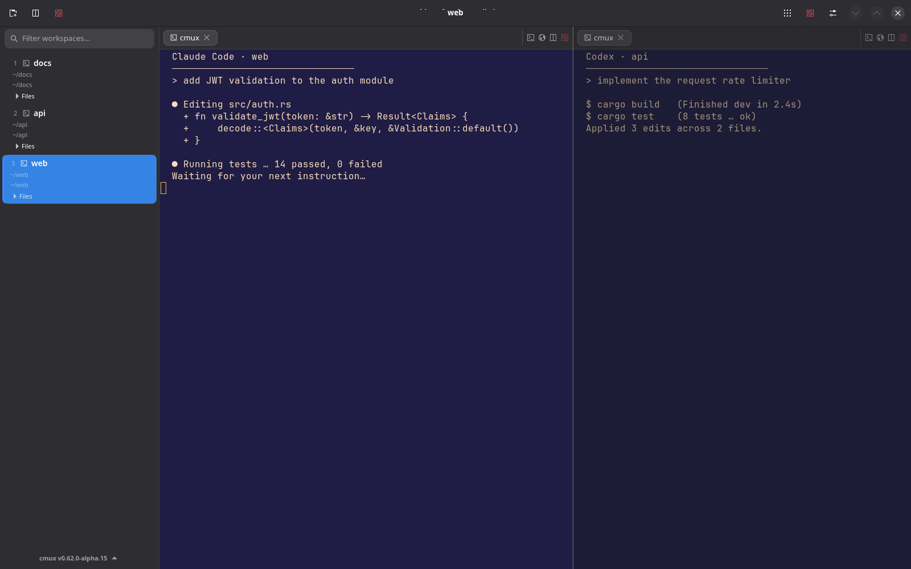
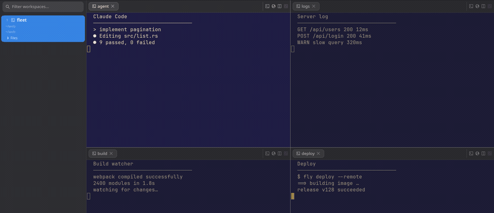
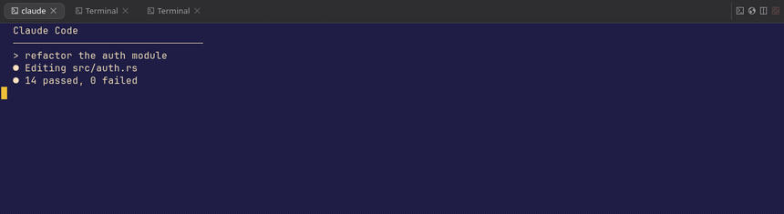
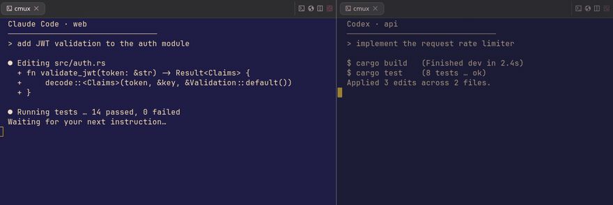
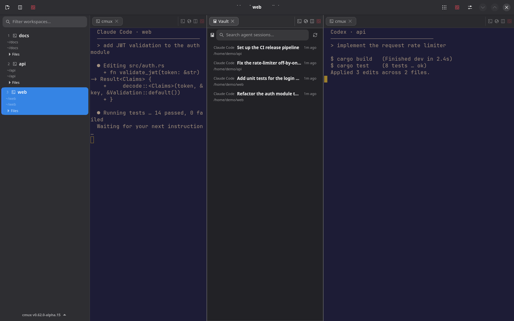
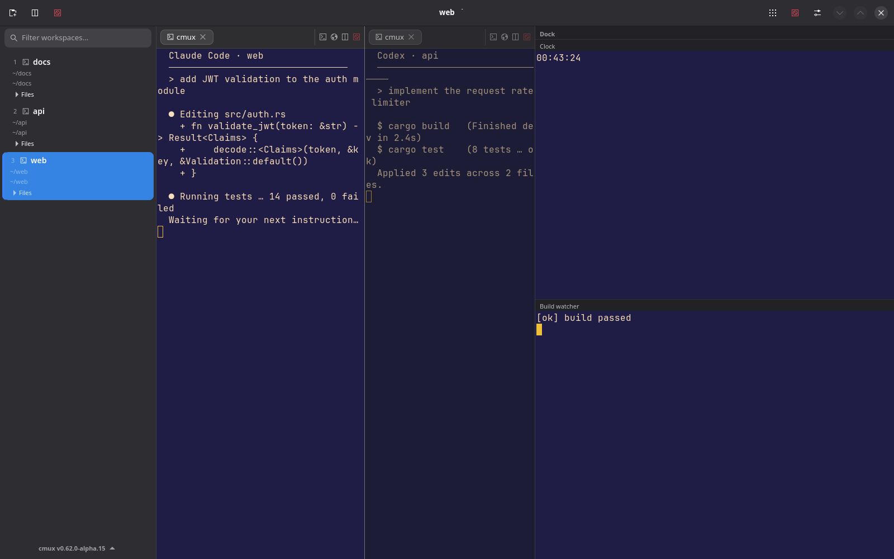
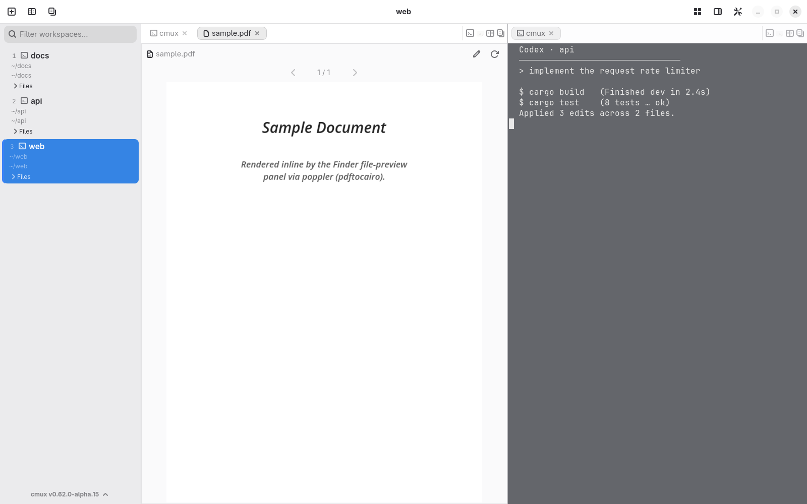
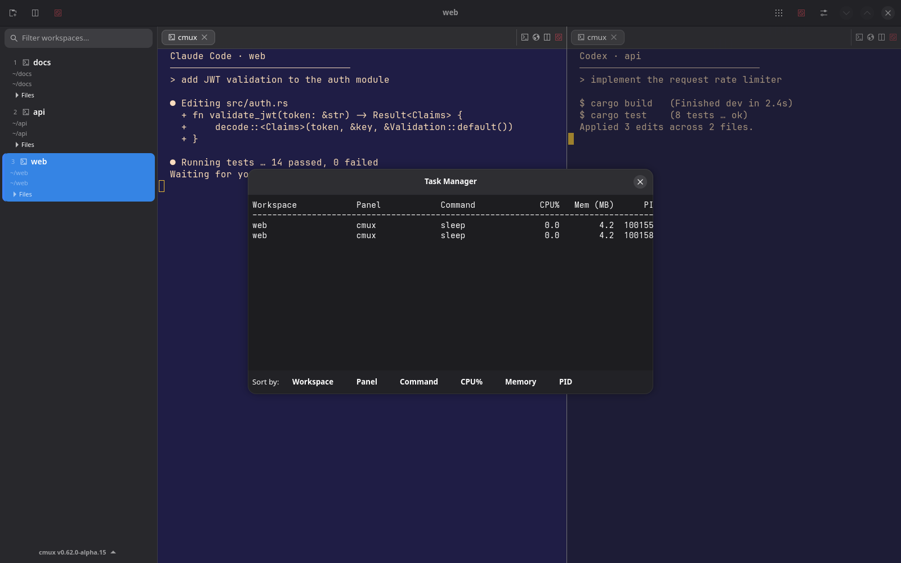
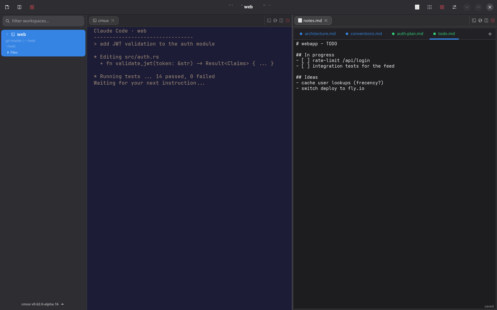
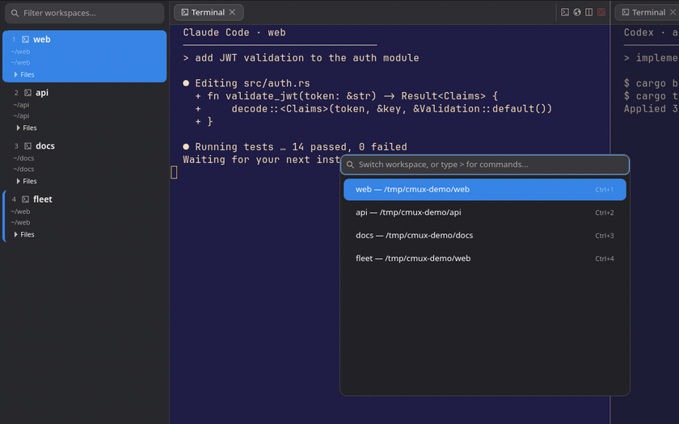

# cmux-gtk

**A GTK4/libadwaita terminal multiplexer built for running many AI coding agents at once.** Rust + [Ghostty](https://ghostty.org). A Linux port of [cmux](https://cmux.com), tracking its feature set.



> **Note:** the screenshots and GIFs below are real captures, generated privacy-safely (synthetic demo data, no real paths) by [`docs/autocapture.sh`](docs/autocapture.sh) and [`docs/capture-tools/make-gifs.sh`](docs/capture-tools/make-gifs.sh) running cmux in a headless compositor. The GIFs drive real GTK interactions through a tiny `wlr-virtual-pointer`/`virtual-keyboard` client — see [`docs/SCREENSHOTS.md`](docs/SCREENSHOTS.md).

---

## Install

```bash
git submodule update --init
cargo build --release --features cmux/link-ghostty
sudo bash scripts/install.sh          # installs cmux-app + cmux CLI to /usr/local
```

Browser support (WebKit6) is on by default; build without it via `--no-default-features --features cmux/link-ghostty`.

The **quick terminal** (Quake-style drop-down) is an opt-in build that needs `gtk4-layer-shell` and a layer-shell compositor (KDE/wlroots):

```bash
# install libgtk4-layer-shell (e.g. `sudo pacman -S gtk4-layer-shell`), then:
cargo build --release --features cmux/link-ghostty,cmux/quick-terminal
```

---

## Highlights

### Run a fleet of agents, see them all at a glance

**Pane Overview** — a status grid of every pane in the workspace: busy / idle / attention dots (detected from each pane's foreground process), a one-line activity snippet, and click-to-jump. Open it from the header grid button, the palette, or a configurable shortcut.



### Agent integrations — teammates as native panes

`cmux claude-teams` (Claude Code agent-teams) and `cmux omo` (OpenCode / oh-my-openagent) launch agents whose teammates and subagents open as **native cmux panes**. A private tmux shim translates `split-window` / `send-keys` / `capture-pane` → cmux's `surface.split` / `send_text` / `read_text`, and `terminal-notifier` → `cmux notify` — no real tmux required.


### Drag tabs & move panes

Drag a tab to **reorder** it, drop it on a pane edge to **split**, or drop it on a sidebar workspace to **move it across workspaces**. Panes rearrange live.





### History & Vault

| | |
|---|---|
| **History** — `cmux history` opens a searchable, day-grouped list of recently closed & focused workspaces; click to reopen. Closed history persists across restarts. | **Vault** — `cmux vault` indexes past Claude Code / Codex sessions with title/dir/preview search; click a session to resume it in a terminal. |
|  |  |

### Dock — always-on terminal controls

A right-side column of small terminal "controls" (lazygit, log tails, build watchers) defined in `.cmux/dock.json` or `~/.config/cmux/dock.json`. Edit them from a GUI (**Settings → Dock → Edit Dock Controls**). Hidden by default; toggle from the header.


| Dock controls | Dock editor |
|---|---|
|  |  |

### TextBox — compose prompts before sending

An opt-in multi-line input below a terminal for composing multi-line agent prompts. Enter sends, Shift+Enter adds a newline, Esc returns to the terminal.


### Finder previews & Task Manager

| Finder previews | Task Manager |
|---|---|
| Inline **image, video, and PDF** previews (PDF rendered page-by-page via poppler) — ideal for reviewing screenshots and demo recordings agents produce. | `cmux top` opens a CPU/RAM monitor for the agent & terminal processes in your workspaces. |
|  |  |

### Panels — more than terminals

Any pane can hold a non-terminal view: a **rendered Markdown** file, a **git diff** (with a Staged toggle and branch compare), a **project tree** with a file-type summary, an **editable Notes** scratchpad beside your terminal, or a full **WebKit browser** with a Playwright-style automation API.

| Markdown viewer | Diff viewer |
|---|---|
|  |  |
| **Project visualizer** | **Notes scratchpad** |
|  |  |


### Command palette & custom commands

Fuzzy command palette and workspace switcher. Define your own entries in `cmux.json` (project `.cmux/cmux.json`, project root, or global) that run a shell command **or** open a whole multi-pane `workspace` layout.



---

## All features

### Workspaces, panes & windows
- **Terminal multiplexer** — workspaces, split panes, tab management, directional focus
- **Move tabs & panes** — drag a tab to reorder, split a pane (drop on an edge), or move it to another workspace; break/join panes across workspaces
- **New tab** — `Ctrl+Shift+T` opens a new terminal in the current pane, inheriting the focused terminal's working directory
- **Per-workspace environment** — `workspace.env` in a `cmux.json` layout injects variables into every shell spawned in that workspace
- **Pane overview** — status grid of every pane (busy/idle/attention) with click-to-jump (header button / palette / `overview.open`)
- **Multi-window** — single-instance app; launching again opens a new window, workspaces assignable across windows
- **Quick terminal** — Quake-style drop-down that slides in from the top edge (chromeless layer-shell overlay, no titlebar), toggled by a configurable global hotkey (GlobalShortcuts portal) or `cmux quick-terminal toggle`. Opt-in build (`--features cmux/quick-terminal`); enable + set the hotkey/height in **Settings → Quick Terminal**
- **Workspace groups** — collapsible sidebar sections with per-group color, unread badges, drag-anchored membership, persistence (`cmux group`)
- **Workspace management** — pinning, custom colors, reorder, close-others/above/below
- **Workspace descriptions** — free-text per-workspace notes (`cmux describe`), shown in the sidebar tooltip
- **Focus history** — back/forward through recently-focused workspaces (`cmux back`/`forward`)
- **Reopen closed workspace** — `cmux reopen` restores the most recently closed workspace (layout + cwd, fresh shells)
- **Reopen closed tab** — `cmux reopen-tab` restores the most recently closed panel in the current workspace (type/dir/command preserved)
- **Agent hibernation** — pause (SIGSTOP) an idle agent to free CPU and resume (SIGCONT) on demand (`cmux hibernate`/`wake`)
- **Display placement** — `cmux window displays` / `cmux window display <name|index>` moves the window to a monitor

### Panels
- **Terminal** — Ghostty-backed GL surfaces with vi-style copy mode and a vim badge indicator
- **Integrated browser** — WebKit6 panels with 120+ automation commands (Playwright-style API), profiles, history, focus mode
- **Markdown viewer** — `cmux open file.md` / drag from the sidebar; renders **Mermaid diagrams**
- **Diff viewer** — `cmux diff [path]` git diff CodeView (`--staged` / `--branch <ref>`); plain-GTK, no WebKit; **syntax-highlighted** lines and right-click **review comments** (persisted to `.cmux/diff-comments.json`)
- **Project visualizer** — `cmux project [path]` directory tree + file-type/size summary
- **Finder previews** — inline image / video / **PDF** (poppler) previews in the file-preview panel
- **File explorer** — sidebar tree with configurable double-click action (preview / default app / preferred editor) and **Insert Path / Insert Relative Path** into the focused terminal
- **Notes scratchpad** — `cmux notes [file]` editable, auto-saved; path configurable in Settings
- **Word wrap** — toggle line wrapping for the file preview/editor and notes panels (Settings → Editor & Files)
- **History pane** — `cmux history` searchable day-grouped closed/focused workspaces
- **Vault pane** — `cmux vault` searchable index of past Claude Code / Codex sessions, click to resume

### AI agent workflow
- **Agent integrations** — `cmux claude-teams` & `cmux omo` open teammates/subagents as native panes via a tmux shim; `terminal-notifier` → `cmux notify`. Turnkey status/notification hooks: `cmux claude-hook` / `codex-hook` / `kiro-hook` / `cursor-hook` / `gemini-hook` (or generic `cmux agent hook … --cli <name>`)
- **AI workspace auto-naming** — opt-in: name an untitled workspace from its agent transcript when the agent finishes (`cmux ai-name`, or auto via Settings; uses `ANTHROPIC_API_KEY`)
- **Task Manager** — `cmux top` CPU/RAM monitor (also `cmux ps` for JSON)
- **TextBox** — multi-line prompt composer below terminals (opt-in)
- **Dock** — right-side terminal controls from `dock.json`, with a GUI editor
- **Custom commands** — `cmux.json` palette entries: shell commands or multi-pane `workspace` layouts (recursive `split`/`pane`/`surfaces` with per-surface `command`/`cwd`/`url`/`focus`)
- **Sidebar metadata** — status pills, metadata blocks, progress bars, log entries, PR check icons, hide-all-details toggle
- **Notifications** — OSC 9/777 desktop notifications with pane attention ring; freedesktop sound presets

### Browser
- 120+ `browser.*` automation commands (Playwright-style)
- Per-profile isolated NetworkSession with persistent cookies; cookie import
- Frecency-scored history with omnibar autocomplete
- Search engines (DuckDuckGo/Google/Bing/Kagi/Startpage/Custom) + **keyword search providers** (`gh rust` → GitHub search)
- `window.open`/`target=_blank` → new tab, Ctrl/middle-click → new tab, mouse 8/9 back/forward, deep-link handling, HTTP interstitial with allowlist
- Per-tab audio mute, distraction-free focus mode, React component grab
- System/Light/Dark theme override; UA override, camera/mic/geo denied by default

### CLI & automation
- **Socket API** — V1 text (60 commands) + V2 JSON-RPC (210+ methods)
- **CLI wrapper** — `cmux/bin/cmux <command>` (socket auto-discovery)
- **Diagnostics** — `cmux config doctor` checks install, daemon reachability, and config-file health
- **Open in IDE** — `cmux ide [editor] [dir]` opens a directory in VS Code / IntelliJ / Cursor / Zed / Sublime / …
- **tmux compatibility** — CLI shim maps tmux commands to the socket API
- **Claude Code wrapper** — `cmux/bin/claude` injects status/notification hooks
- **URL routing** — `cmux/bin/xdg-open` routes HTTP(S) to the in-app browser

### Integration & platform
- **Shell integration** — auto-injected (zsh/bash/fish): CWD, git branch, PR polling, semantic prompts
- **Remote SSH workspaces** — `cmux ssh user@host` with auto-bootstrap daemon, SOCKS5 proxy tunnel for browser traffic, CLI relay
- **Session persistence** — scrollback, geometry, zoom, URLs, browser history, closed-tab history restored on restart
- **Ghostty config** — reads `~/.config/ghostty/config` (themes, fonts, colors, opacity); live reload via `Ctrl+Shift+,`
- **Themes** — `cmux themes [filter]`; Omarchy `colors.toml` with SIGUSR2 live reload
- **App icon** — installed into the hicolor theme (SVG + 32–256px PNG) with a pixmaps fallback

---

## Keyboard shortcuts

All shortcuts are configurable via `~/.config/cmux/shortcuts.json` (or **Settings → Keyboard**). A per-action `when` clause (VS Code-style: `terminalFocused`, `browserFocused`, `editorFocused`, `panelFocused`, `paneZoomed`, combined with `&&`/`||`/`!`) can gate a binding by context.

| Shortcut | Action |
|----------|--------|
| Ctrl+Shift+T | New tab in the current pane |
| Ctrl+Shift+N | New window |
| Ctrl+Shift+W | Close workspace |
| Ctrl+Shift+Q | Close focused pane |
| Ctrl+Shift+D / E | Split horizontally / vertically |
| Ctrl+Shift+P | Command palette |
| Ctrl+P | Search all terminals |
| Ctrl+F / G / Shift+G | Find / next / previous |
| Ctrl+Shift+B | Toggle sidebar |
| Ctrl+Shift+Z | Toggle pane zoom |
| Ctrl+Shift+M | Enter copy mode |
| Ctrl+Shift+U | Jump to latest unread |
| Ctrl+1–9 | Jump to workspace |
| Ctrl+Tab / Ctrl+Shift+Tab | Next / previous workspace |
| Alt+Arrow | Focus pane in direction |
| Ctrl+, | Settings |

**Configurable, unbound by default** (bind in Settings → Keyboard): `tab.reopen` (reopen closed tab), `textbox.focus`, `dock.toggle`, `overview.open`. These are unbound because, with a terminal focused, ghostty's Kitty keyboard protocol encodes `Ctrl+Shift+<key>` to the shell before cmux sees it — so the **header buttons and command palette are the reliable triggers** for the Dock and Overview.

---

## Configuration files

| File | Purpose |
|------|---------|
| `~/.config/cmux/settings.json` (or `cmux.json`) | App settings |
| `~/.config/cmux/shortcuts.json` | Keybindings |
| `.cmux/cmux.json` / `cmux.json` / `~/.config/cmux/cmux.json` | Custom commands (`commands[]`, optional `workspace` layouts) |
| `.cmux/dock.json` / `~/.config/cmux/dock.json` | Dock controls (`id`/`title`/`command`/`cwd`/`height`) |

---

## Architecture

- `ghostty-sys/` — Raw FFI bindings to libghostty (`ghostty.h`)
- `ghostty-gtk/` — Safe Rust wrapper: GhosttyApp, GhosttyGlSurface, key mapping
- `cmux/` — Main application (GTK4/libadwaita)
  - `app.rs` — AppState, SharedState, terminal surface lifecycle, window management
  - `model/` — TabManager, Workspace, Panel, LayoutNode
  - `ui/` — window, sidebar, split view, terminal/browser/markdown/diff/project/file-preview/notes/history/vault panels, dock, textbox, pane overview, command palette, settings
  - `socket/` — Unix socket server, V1 text + V2 JSON protocols, browser automation, auth
  - `session/` — session persistence (XDG, JSON compatible with macOS cmux)
  - `settings/` — AppSettings, ShortcutConfig, custom commands
  - `remote/` — remote SSH workspaces (bootstrap, proxy tunnel, RPC, CLI relay)
- `cmux/bin/` — `cmux` (CLI), `claude` (hook wrapper), `xdg-open` (URL routing)
- `cmux/shell-integration/` — auto-injected zsh/bash/fish integration scripts

**Read `docs/architecture-review.md` before making structural changes** — it documents the Ghostty integration constraints.

---

## Socket protocol

Unix socket at `$XDG_RUNTIME_DIR/cmux.sock` (falls back to `/tmp/cmux-$UID.sock`). V1 text (60 commands) + V2 JSON-RPC (210+ methods) + 120+ `browser.*` automation commands. Use `cmux/bin/cmux <command> [args...]`.

## Environment variables

| Variable | Description |
|----------|-------------|
| `CMUX_SOCKET` | Override socket path |
| `CMUX_DISABLE_SESSION_RESTORE` | Set to `1` to skip session restore |
| `CMUXD_PROXY_ALLOW_PRIVATE` | Set to `1` on the **remote host** to allow the SOCKS5 proxy to reach private/loopback IPs |

## Security

See [docs/security.md](docs/security.md). Socket auth via `SO_PEERCRED`, HMAC-SHA256 relay auth, 0o600/0o700 file perms, input validation, documented `unsafe` with panic guards, SSRF denylist on the proxy tunnel, `cargo audit` in CI.

## Reference

- ghostty C API: `ghostty.h` in the ghostty submodule
- Ghostty GTK runtime: `ghostty/src/apprt/gtk/`
