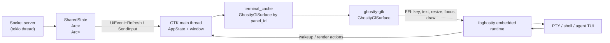
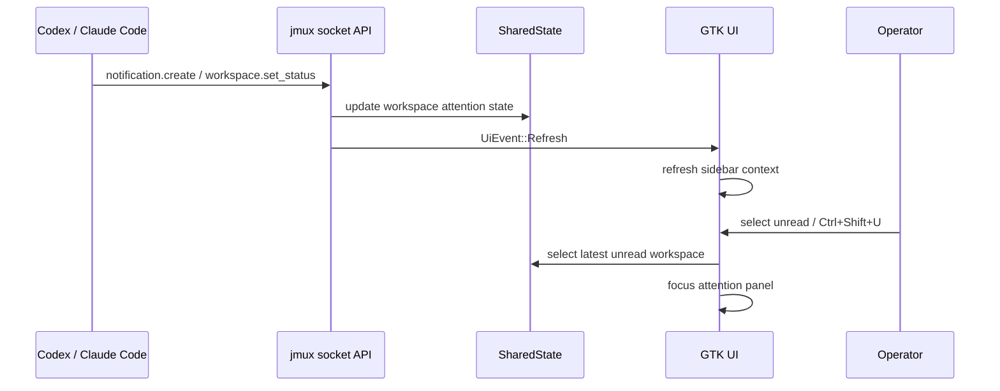
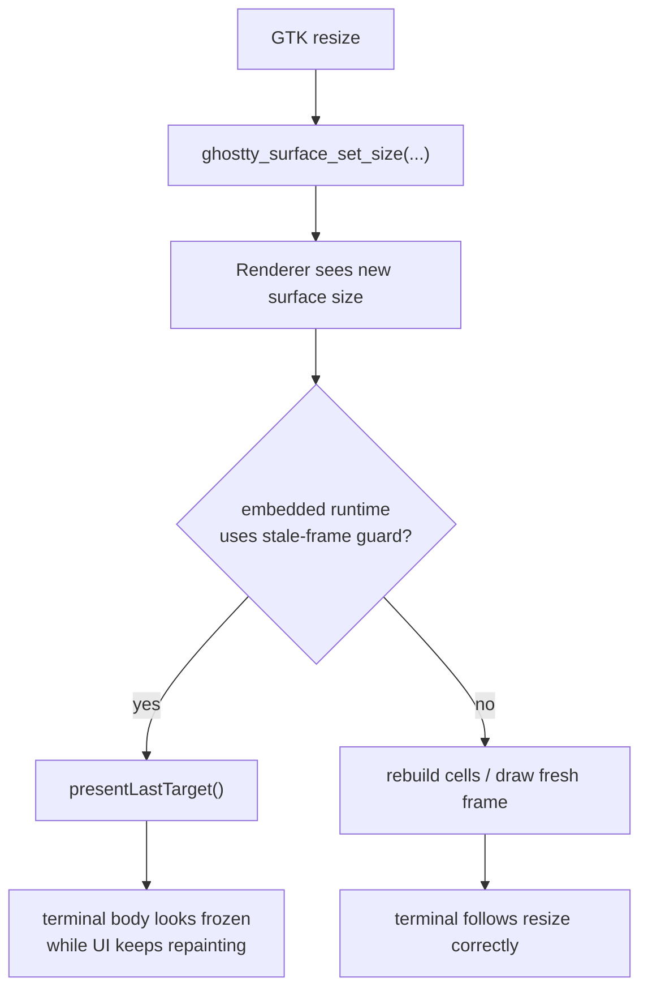
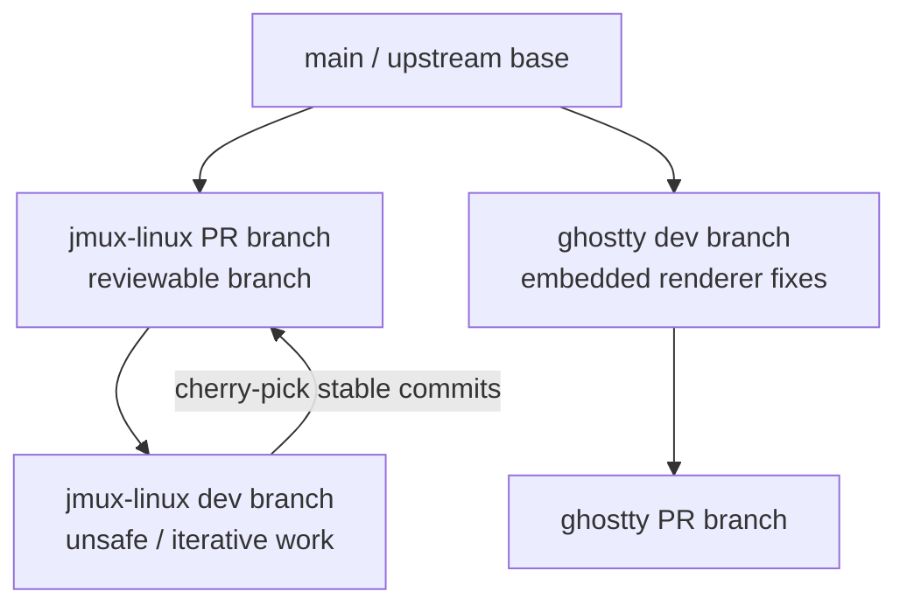

# Architecture Review

> **Historical document** (2026-03-10). Ghostty dependency risks noted below have since been resolved — the project now uses `douglas/ghostty` fork with Linux embedded support based on upstream 1.3.1. See CHANGELOG.md for details.

Reviewed: 2026-03-10

This review is for the current Ubuntu MVP implementation only.
It focuses on architecture, state ownership, integration boundaries, and release risk.

## Executive Summary

The current direction is correct.

- `jmux` owns attention flow, workspace state, unread routing, and terminal widget identity.
- `ghostty-gtk` owns GTK adaptation: GL context, viewport, resize propagation, IME, focus, scroll, and input forwarding.
- `ghostty` core owns renderer policy and PTY/render lifecycle.

The most important design conclusion from this round is:

> The resize freeze was not a `jmux` layout bug. It was an embedded renderer policy bug in Ghostty.

That matters because it validates the current layer boundaries. We should keep the fix in the renderer layer, not paper over it in the GTK host.

## System Boundaries

## Attention Loop

This is the correct MVP core.

The product value is not "many terminal tabs."
The product value is "notice -> identify -> jump" under multi-agent load.

## Resize Root Cause

The actual fix lives in [generic.zig](../../ghostty/src/renderer/generic.zig).

That is the right layer for the fix because the behavior is a renderer presentation policy, not a GTK event-dispatch problem.

## What Is Architecturally Sound

### 1. Terminal widget caching belongs in `jmux`

`jmux` now preserves terminal widget identity by `panel_id` in [app.rs](../jmux/src/app.rs).

That is the correct ownership model:

- workspace/panel identity is a `jmux` concern
- surface reuse policy is a `jmux` concern
- `ghostty` should not know about workspace switching

The cache also prevents state loss across sidebar refreshes and workspace switches.

### 2. GTK adaptation belongs in `ghostty-gtk`

The following are correctly implemented in [surface.rs](../ghostty-gtk/src/surface.rs):

- explicit desktop GL 4.3 context creation
- `glViewport(...)` before draw
- size and content-scale propagation on resize
- IME preedit/commit integration
- focus handoff and resize-time focus recovery
- scroll direction normalization
- click-to-focus

All of those are host integration concerns, so `ghostty-gtk` is the right place for them.

### 3. Renderer policy belongs in `ghostty`

The stale-frame guard change in [generic.zig](../../ghostty/src/renderer/generic.zig) is principled.

The old behavior was reasonable for native host runtimes that prefer avoiding blank flashes during synchronous resize redraws.
It is not reasonable for the embedded runtime, where the host is already tightly driving resize and redraw.

The embedded runtime should not inherit native-host presentation heuristics blindly.

## Findings

### P1: Push risk because the required resize fix is not on upstream `ghostty` main yet

As of 2026-03-10, this branch depends on the root `ghostty` submodule being pinned to a commit from `fork/draft/linux-embedded-host-support`, not `origin/main`.

That means the verified resize fix is still not self-contained in an upstream-reviewable Ghostty base.

Impact:

- pushing only the `jmux-linux` PR does not fully reproduce the working behavior
- review becomes misleading if the Ghostty dependency is not called out explicitly

Recommendation:

- do not hide this dependency
- split the Ghostty renderer fix into its own branch/PR if it is not already isolated
- make the `jmux-linux` PR explicitly depend on that Ghostty change

### ~~P2: UI event delivery still uses 33ms polling~~ (RESOLVED)

**Resolved.** [window.rs](../jmux/src/ui/window.rs) now uses `glib::MainContext::default().spawn_local()` with async `recv().await` on a tokio mpsc channel. No more 33ms polling — events are delivered immediately when they arrive. The `try_recv()` is only used in a drain loop after the initial async wake to batch multiple pending events.

### P2: Focus recovery is intentionally heuristic

[surface.rs](../ghostty-gtk/src/surface.rs) uses delayed focus disarm and delayed resize-time focus restore.

This was a practical fix for GTK resize/focus churn and it works.
It is still policy, not a guaranteed GTK invariant.

Risk:

- future toolbar/sidebar interactions may expose over-eager focus return

Recommendation:

- acceptable for MVP
- keep an eye on explicit focus ownership once more non-terminal controls are added

### P3: Distribution story is still development-grade

[build.rs](../ghostty-sys/build.rs) now builds and links Ghostty for local development, but packaging is not final.

Open questions remain:

- dynamic library search path
- bundling of `libghostty`
- reproducible install layout

This is not blocking the MVP review, but it is not release-finished.

## Recommended Branch Strategy

Because this work spans `jmux-linux` and external `ghostty`, the branch strategy should make that explicit.

Recommended workflow:

1. keep `#828` as the clean review branch
2. create a separate `jmux-linux` dev branch for ongoing experiments
3. create a separate Ghostty branch for embedded renderer changes
4. cherry-pick only stable commits back to the review branch
5. link the `jmux-linux` PR to the Ghostty PR explicitly

## Review Conclusion

The current MVP architecture is directionally correct.

The key positive result is that the layers are finally telling the truth:

- `jmux` handles attention and workspace semantics
- `ghostty-gtk` handles GTK adaptation
- `ghostty` handles rendering policy

The main release risk is not bad architecture inside `jmux`.
The main release risk is cross-repo coupling: a required runtime fix currently lives in Ghostty, outside the PR branch that would be reviewed first.

## Push Recommendation

Do not push the current `jmux-linux` branch as if it were self-contained.

Push plan:

1. split the Ghostty embedded resize fix into its own branch
2. keep the `jmux-linux` PR branch review-clean
3. mention the cross-repo dependency in the PR description
4. only then push the PR branch
